# Лабораторная работа №2  
## Введение в AWS. Вычислительные сервисы

---

## Ссылка на GitHub
https://github.com/olgacriclivaia/lab2-aws

---

## Цель работы
Познакомиться с основными вычислительными сервисами AWS, научиться создавать и настраивать виртуальные машины (EC2), а также развёртывать простые веб-приложения.

---

## Постановка задачи
Создать AWS-инфраструктуру, включающую IAM пользователя, бюджет, EC2-инстанс, а также развернуть веб-сервер и подключиться к нему по SSH.

---

## Ход выполнения работы

---

## 1. Подготовка среды

Выполнен вход в AWS Management Console.  
Выбран регион: **EU (Frankfurt) eu-central-1**

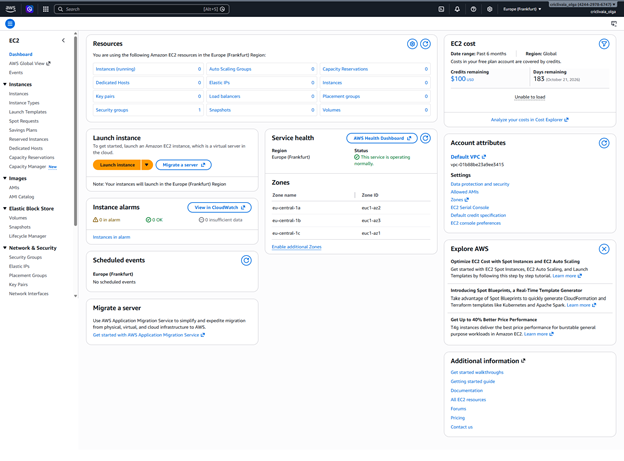

---

## 2. Создание IAM группы и пользователя

Создана группа **Admins** с политикой `AdministratorAccess`.

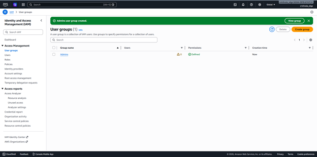

Создан пользователь и добавлен в группу.

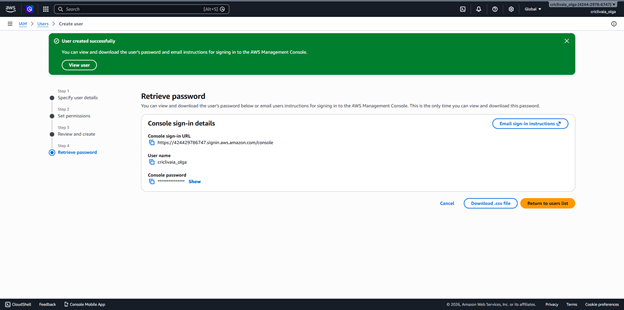

Выполнен вход под IAM пользователем.

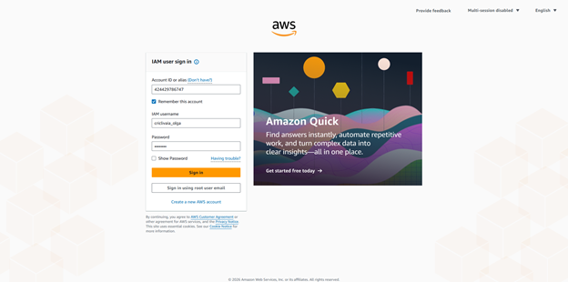

---

### Ответ на вопрос:
Политика **AdministratorAccess** предоставляет полный доступ ко всем ресурсам и сервисам AWS.

---

## 3. Настройка Zero-Spend Budget

Создан бюджет для контроля расходов.

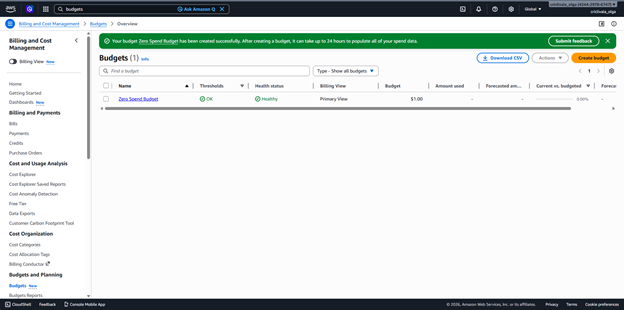

---

## 4. Создание EC2 инстанса

Создана пара ключей для подключения по SSH.

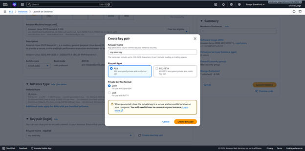

Настроен и запущен EC2-инстанс:

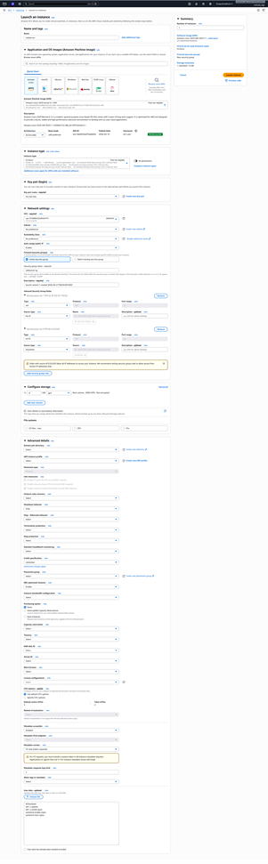

Инстанс успешно создан.

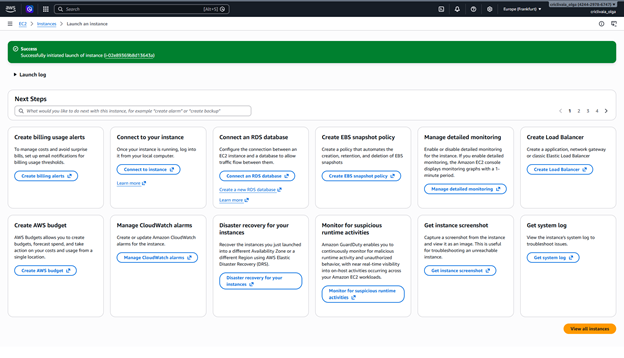

Список инстансов:

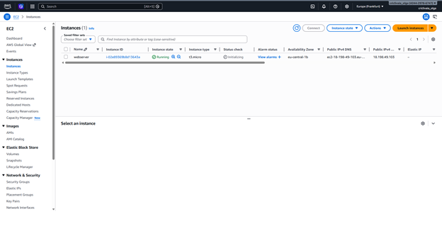

Детали инстанса:

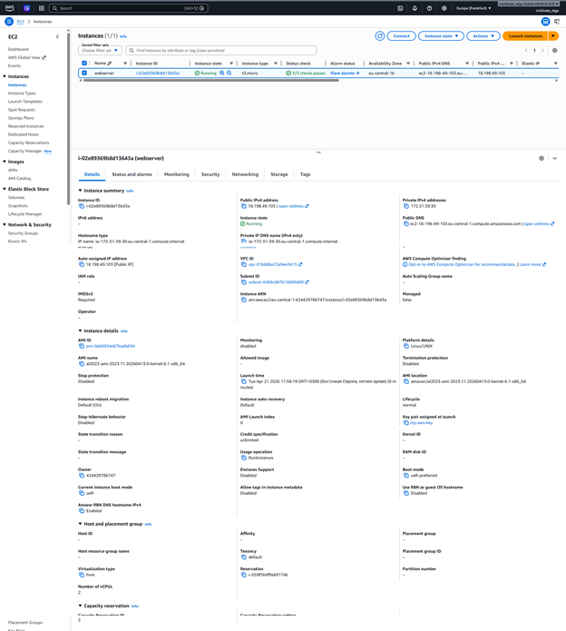

---

### Ответ на вопрос:
**User Data** — это скрипт, который автоматически выполняется при запуске инстанса.

В данном случае он:
- обновляет систему
- устанавливает nginx
- запускает веб-сервер

**nginx** — это веб-сервер, который обрабатывает HTTP-запросы и отображает веб-страницы.

---

## 5. Мониторинг и логирование

Проверка состояния инстанса:

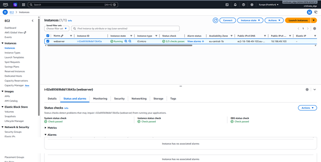

Мониторинг через CloudWatch:

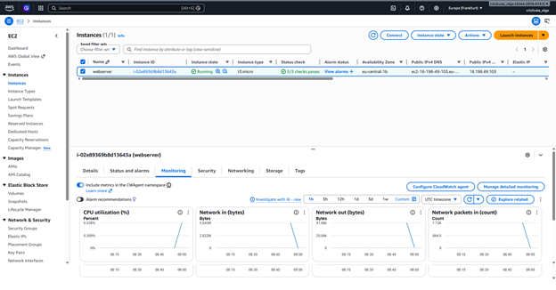

Просмотр системного лога:

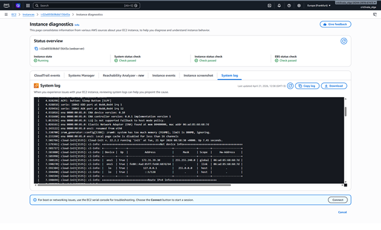

Скриншот инстанса:

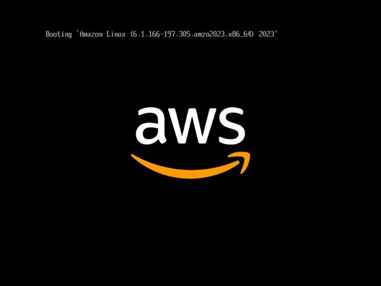

---

### Ответ на вопрос:
Детализированный мониторинг используется, когда требуется более точный контроль (например, в production-среде).

---

## 6. Подключение по SSH

Успешное подключение к EC2:

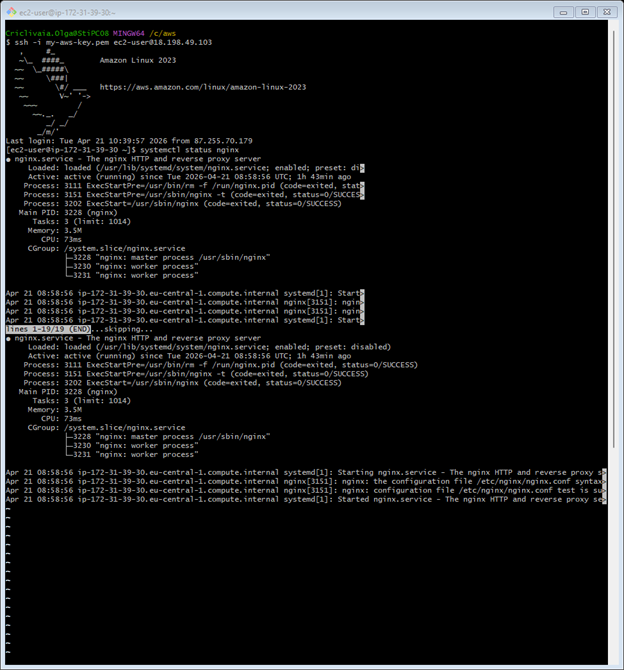

---

### Ответ на вопрос:
Пароль не используется, так как SSH-ключи обеспечивают более высокий уровень безопасности.

---

## 7. Развёртывание статического сайта

Созданы HTML-файлы на локальном компьютере:

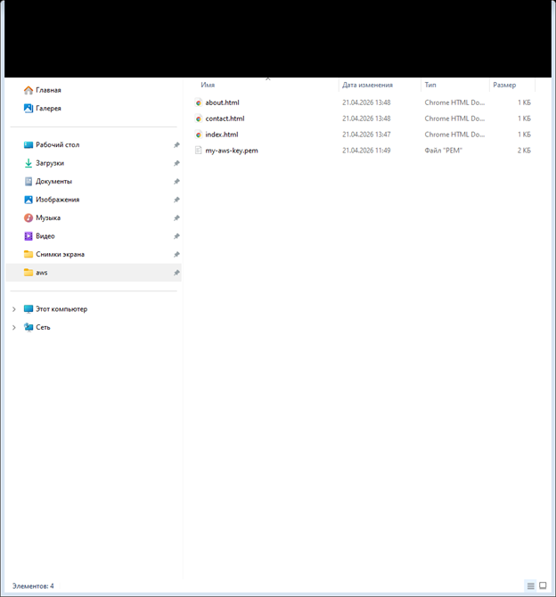

Подключение к серверу:

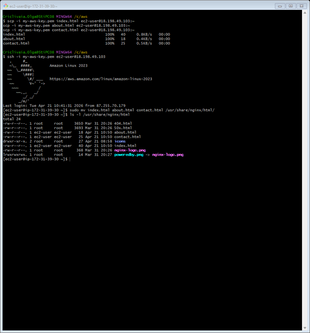

Сайт успешно открыт в браузере:

---

### Ответ на вопрос:
Команда **scp** используется для безопасной передачи файлов между локальным компьютером и сервером по SSH.

---

## 8. Завершение работы

Инстанс остановлен.

---

### Ответ на вопрос:
- **Stop** — останавливает инстанс (его можно снова запустить)
- **Terminate** — полностью удаляет инстанс без возможности восстановления

---

## Вывод

В ходе лабораторной работы были изучены основные возможности AWS, включая создание пользователей, настройку бюджета, запуск EC2-инстанса, подключение по SSH и развёртывание веб-сервера.

---

## Список источников

- https://aws.amazon.com/
- https://docs.aws.amazon.com/